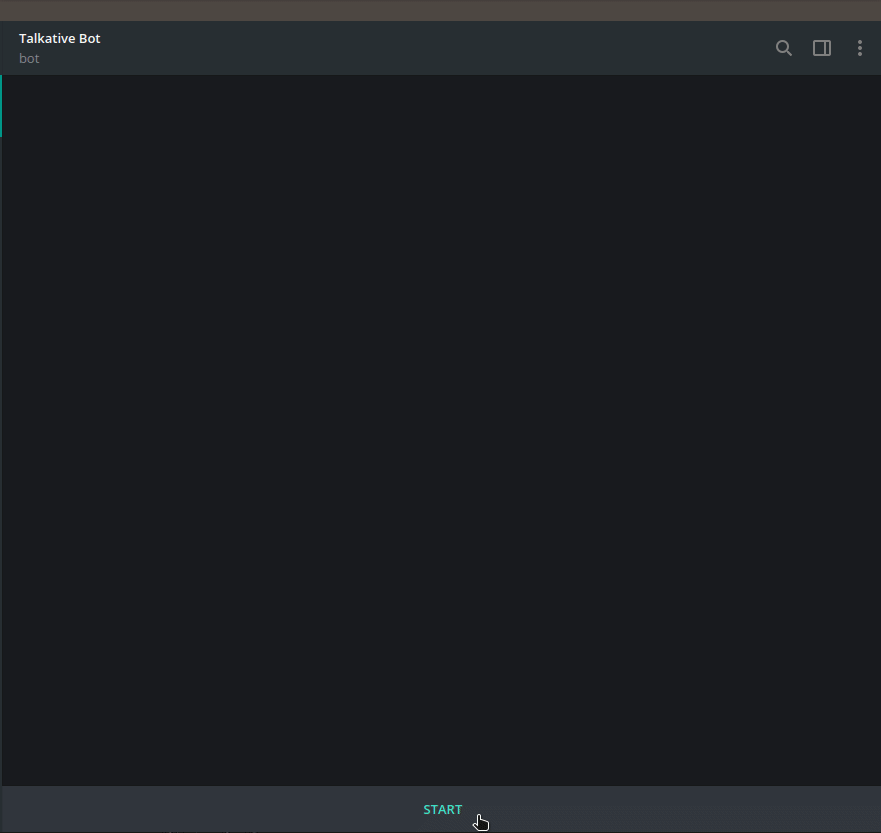

## The book bot

**Design idea**: The book bot is a Telegram bot for answering book-related questions. 
Users are provided an intutive interface that allows them to easily access information about books, 
very similar to asking a book store clerk. The bot relies on the APIs of Google Books and 
Goodreads to extract structured information about books. 

**Final product**: The submitted version of the bot meets the core design aims. In additional to greeting users and sending
a goodbye message when a appropriate, it also allows users to use natural language to access the following information about a given book:

1. The author
2. A summary
3. The price
4. Its ratings on Goodreads, a book discussion platform.

Moreover, it can also list all the books written by a given author when asked to do so.

Using the chatbot is easy, as there are no specific keywords to memorize. Users can simply ask a question in the same way
they would also ask a book clerk. This allows for greater flexibility, but also places higher requirements on the natural
language understanding component of the system: It needs to be able to deal with certain semantical properties of natural
language, in order for communication to be successful. We tried addressing one particularly important properties, namely
co-reference. The results are described below.

## Set-up
To run the back-end of the chatbot for yourself, the dependencies from the requirements.txt file need to be installed in python3:

`pip3 install -r requirements.txt` (in linux)

To additionally retrain the intent classification model or to use the co-reference detection components, a SpaCy
language model will have to be installed. This can be done by running the following commands:

`python3 -m spacy download en_core_web_md`
`python3 -m spacy link en_core_web_md en`

To query the chatbot, this repository should be cloned:
`git clone <repos>`

And the telegram.py script should be run using python3:
`python3 telegram.py`

When the terminal shows the message `ready` questions about books can be sent to the "Talkative Bot" chatbot (@tlktv_bot).

## Natural language understanding

The bot needs to be able to understand what the user wants to know about in order to query the relevant database 
and return the relevant information. We defined a number of possible **intents** a user might have, e.g. the *price* intent
that is triggered when the user wants to know how much a book costs. Some of these intents have associated **entities**
that need to be present in a sentence for the intent to be resolved. For instance, a *bookName* entity needs to be present
for the price intent to be correctly answered.

The bot relies on the [RASA-NLU library](https://github.com/RasaHQ/rasa_nlu)
for intent and entity extraction. We trained an adjusted version of the RASA-NLU *spacy_sklearn* pipeline
on a hand-crafted dataset of labelled sentences.
Our pipeline applies the following steps to an input sentence:

1. Tokenization, using the SpaCy tokenizer.
2. Feature extraction for the intent classifier. Each sentence is transformed into the average of its
word embedding vectors. For training, pre-trained 300-dimensional word embeddings from the 
[SpaCy WebMD corpus](https://spacy.io/models/en#en_core_web_lg) were used.
3. Intent classification using a linear SVM based on the features extracted in step 3.
4. Feature extraction for the entity extraction component. This step extracts word features, such as whether or not a
word is upper-case or word part-of-speech tags.
5. Conditional random fields (CRF) for entity extraction. The CRF component predicts a sequence of entity tags 
for a given sentence. This is done by conducting a statistical inference that treats entity tags as hidden states.
The extracted word features are used for this step. This component was trained using our training data and predicts
tags from the following set = {None, bookName, authorName}.
6. Named-entity recognition using the SpaCy NER component. It parses the whole sentence and returns a set of entities
extracted from the sentence. The entities are from the default [SpaCy ontology](https://spacy.io/usage/linguistic-features#section-named-entities). We map WORK_OF_ART and ORG to book titles and PERSON to author names.

Combining the pre-trained entity recognition model with the CRF trained on our own data allowed us to substantially
improve the entity recall of the system.

## Co-reference detection
We experimented with using the [NeuralCoref](https://github.com/huggingface/neuralcoref) package for co-reference resolution, but the performance of the system was too low to be used. Consequently, we built a simple system for detecting co-references that operates if no entity is found in a string and determines whether it contains a co-reference based on the POS tags of its words. In case we conclude there is co-reference, we inform the user about the fact that the system can currently not deal with it and ask them to rephrase the question.

## APIs / Information sources

### Google Books
We use the approximate book title provided by the user to run a search on the Google Books API. This returns 
a JSON object which contains a list of search results. We select the first result and extract information from
the search result, such as the book description, the sale price or the ISBN.

### Goodreads
We use the [Goodreads API](https://www.goodreads.com/api) to be able to answer questions for a list of books written by a certain author and the ratings of a certain book.

To get the list of books written by an author we call the [author.books](https://www.goodreads.com/api/index#author.books) endpoint, where  first we need to get the authorId from the [search.authors](https://www.goodreads.com/api/index#search.authors) endpoint and then paginate over the xml responses listing different books written by the author. The xml responses are read and the information required is written to a python dictionary, allowing complex information to be saved in an orderly fashion.

To get the ratings of a certain book, the information from two endpoints is combined. Both take a book ISBN (resolved by the Google Books API) and return a python dictionary containing relevant information. The first endpoint called is [book.show_by_isbn](https://www.goodreads.com/api/index#book.show_by_isbn)  which returns an xml with loads of information on a book and is read out and put into a python dictionary. The second endpoint called is [book.review_counts](https://www.goodreads.com/api/index#book.review_counts)  which returns ratings info on a book additional to the ones returned by [book.show_by_isbn](https://www.goodreads.com/api/index#book.show_by_isbn) . The results are combined into a single python dictionary and from this dictionary the rating for a book is read.

Other enpoints which can be called from the python script and are implemented in the api file are: 
- [author.show](https://www.goodreads.com/api/index#author.show): return loads of info on an author
- [book.isbn_to_id](https://www.goodreads.com/api/index#book.isbn_to_id): get a Goodreads bookId given an ISBN
- [book.id_to_work_id](https://www.goodreads.com/api/index#book.id_to_work_id): get workId from Goodreads for a bookId

The python dictionaries containing the all the available information on a book or author would allow us to expand the chatbot to answer other questions. In order to get these to work however, new intents  and training data would have to be created and with handling 5 domain specific questions we believed we'd alreay gone way above the original assignment.

## Sample dialogue

